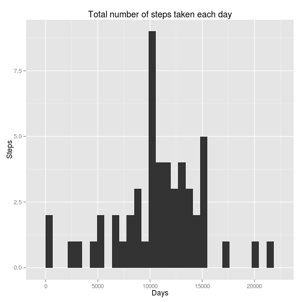
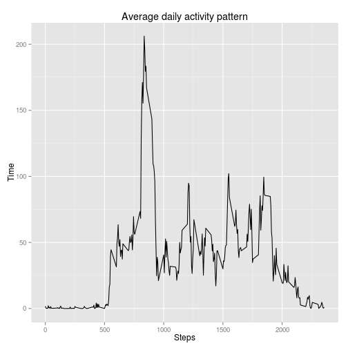
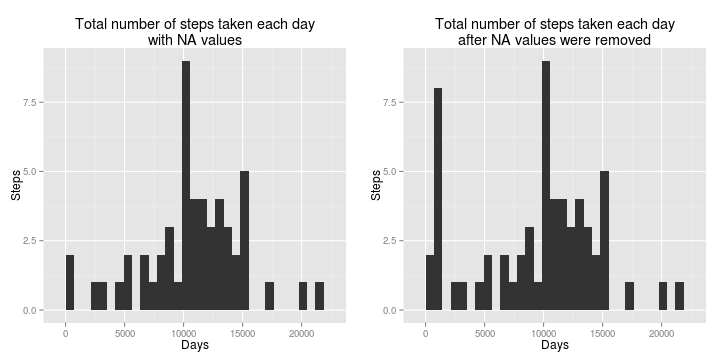
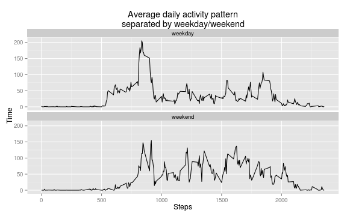

# Reproducible Research: Peer Assessment 1

This work will try to answer the questions what asked [here][1] one the page of **Peer Assignment 1** of the **Reproducible Research** course on Coursera. In this document I will show how did I find answers for that questions. Let's go ヽ(\^ᴗ\^)丿

## Loading and preprocessing the data

I will use the package with data what placed [here][2]. This data file was downloaded and placed inside the repository with work as file with name "*repdata-data-activity.zip*". Let's just unzip it to extract the data. 


```r
unzip("repdata-data-activity.zip")
```

After that let's load data into variable *activity*. File should has name "activity.csv" and I want to remove it after loading. 


```r
activity = read.csv("activity.csv")
file.remove("activity.csv")
```

Let's check what's inside the variable.


```r
str(activity)
```

```
## 'data.frame':	17568 obs. of  3 variables:
##  $ steps   : int  NA NA NA NA NA NA NA NA NA NA ...
##  $ date    : Factor w/ 61 levels "2012-10-01","2012-10-02",..: 1 1 1 1 1 1 1 1 1 1 ...
##  $ interval: int  0 5 10 15 20 25 30 35 40 45 ...
```

Looks good and I can continue.

## What is mean total number of steps taken per day?

Now I need to calculate total number of steps per day. I will use **dplyr** package for that. Let's group our data by *date* and summarise *steps* quantity. 


```r
library(dplyr)
per_day_steps <- select(activity, date, steps)
per_day_steps <- group_by(per_day_steps, date)
per_day_steps <- summarise(per_day_steps, steps = sum(steps))
head(per_day_steps)
```

```
## Source: local data frame [6 x 2]
## 
##         date steps
## 1 2012-10-01    NA
## 2 2012-10-02   126
## 3 2012-10-03 11352
## 4 2012-10-04 12116
## 5 2012-10-05 13294
## 6 2012-10-06 15420
```

I will build histogram of the total number of steps taken each day using **ggplot2** package.


```r
library(ggplot2)
ggplot(per_day_steps, aes(x=steps)) + 
  geom_histogram() + 
  ggtitle("Total number of steps taken each day") + 
  xlab("Days") +
  ylab("Steps") 
```

 

Let's define *mean* and *median* of the total number of steps taken per day.


```r
library(xtable)

report <- 
  data.frame(
    c(mean(per_day_steps$steps, na.rm = TRUE)),
    c(median(per_day_steps$steps, na.rm = TRUE))
  )

colnames(report) <- c("Mean", "Median")
rownames(report) <- c("steps")

print(xtable(report), type="html")
```

<!-- html table generated in R 3.2.0 by xtable 1.7-4 package -->
<!-- Sat Jun 13 21:52:55 2015 -->
<table border=1>
<tr> <th>  </th> <th> Mean </th> <th> Median </th>  </tr>
  <tr> <td align="right"> steps </td> <td align="right"> 10766.19 </td> <td align="right"> 10765 </td> </tr>
   </table>

## What is the average daily activity pattern?

Firstly I will calculate data frame that will store *mean* of steps for each of intervals over all days using **dplyr** package. And after that I will plot the data using **ggplot2** package.


```r
activity_pattern <- select(activity, interval, steps) %>% 
  group_by(interval) %>% 
  summarise(steps = mean(steps, na.rm = TRUE))

ggplot(activity_pattern, aes(x=interval, y=steps)) +
  geom_line() +
  ggtitle("Average daily activity pattern") + 
  xlab("Steps") + 
  ylab("Time")
```

 

## Imputing missing values

Let't find the number of missed values in the original dataset. I will use **dplyr** package functions to find out these values.  


```r
na_count <- select(activity, steps) %>% filter(is.na(steps)) %>% count()
na_count[[1]]
```

```
## [1] 2304
```

It looks like count of *NA* values is 2304. I need to fix missed values somehow. I will use *median* for the interval throughout all other days because it should has more close value for the "real" interval's one. 

To proceed that, I will find medians of intervals to use it as source of values.


```r
medians_of_intervals <- select(activity, interval, steps) %>% 
  group_by(interval) %>% 
  summarise(steps = median(steps, na.rm = TRUE))
  head(medians_of_intervals)
```

```
## Source: local data frame [6 x 2]
## 
##   interval steps
## 1        0     0
## 2        5     0
## 3       10     0
## 4       15     0
## 5       20     0
## 6       25     0
```

After that, I will use the **apply()** with anonymous function to restore missed values in the cloned dataset. Let's do it. 


```r
fixed_activity <- activity
fixed_activity$steps <- as.numeric(
  apply(activity, 1, function(x) { 
    
      steps_value = x[1]
      interval_value = x[3]
      
      if (is.na(steps_value)){
   
        # Find value of median for this interval
        selected <- select(medians_of_intervals, steps, interval) %>% 
                      filter(interval == as.integer(interval_value))
      
        steps <- selected[[1]]  
        
      } else {
        
        steps <- steps_value
      }
      
      steps
    })
)
str(fixed_activity)
```

```
## 'data.frame':	17568 obs. of  3 variables:
##  $ steps   : num  0 0 0 0 0 0 0 0 0 0 ...
##  $ date    : Factor w/ 61 levels "2012-10-01","2012-10-02",..: 1 1 1 1 1 1 1 1 1 1 ...
##  $ interval: int  0 5 10 15 20 25 30 35 40 45 ...
```
  
That's nice. There are no more *NA* values in our dataset. And I will to recalculate total number of steps per day. But I will use fixed data this time.  


```r
fixed_per_day_steps <- select(fixed_activity, date, steps) %>%
                  group_by(date) %>%
                  summarise(steps = sum(steps))
head(fixed_per_day_steps)
```

```
## Source: local data frame [6 x 2]
## 
##         date steps
## 1 2012-10-01  1141
## 2 2012-10-02   126
## 3 2012-10-03 11352
## 4 2012-10-04 12116
## 5 2012-10-05 13294
## 6 2012-10-06 15420
```

Now I may compare histograms of the total number of steps taken each day with and without *NA* values.


```r
library(grid)
library(gridExtra)

plot1 <- ggplot(per_day_steps, aes(x=steps)) + 
  geom_histogram() + 
  ggtitle("Total number of steps taken each day\nwith NA values") + 
  xlab("Days") +
  ylab("Steps")

plot2 <- ggplot(fixed_per_day_steps, aes(x=steps)) + 
  geom_histogram() + 
  ggtitle("Total number of steps taken each day\nafter NA values were removed") + 
  xlab("Days") +
  ylab("Steps") 

grid.arrange(plot1, plot2, ncol = 2)
```

 

I would also like to compare **Means** and **Medians** of these data with and wothout *NA* values.


```r
report <- 
  data.frame(
    c(
      mean(per_day_steps$steps, na.rm = TRUE), 
      mean(fixed_per_day_steps$steps, na.rm = TRUE)
    ),
    c(
      median(per_day_steps$steps, na.rm = TRUE),
      median(fixed_per_day_steps$steps, na.rm = TRUE)
    )
  )

colnames(report) <- c("Mean", "Median")
rownames(report) <- c("steps (with NA)", "steps (without NA)")

print(xtable(report), type="html")
```

<!-- html table generated in R 3.2.0 by xtable 1.7-4 package -->
<!-- Sat Jun 13 21:52:57 2015 -->
<table border=1>
<tr> <th>  </th> <th> Mean </th> <th> Median </th>  </tr>
  <tr> <td align="right"> steps (with NA) </td> <td align="right"> 10766.19 </td> <td align="right"> 10765.00 </td> </tr>
  <tr> <td align="right"> steps (without NA) </td> <td align="right"> 9503.87 </td> <td align="right"> 10395.00 </td> </tr>
   </table>

It looks like average count of steps per day was reduced after we've imputted missed values. 

## Are there differences in activity patterns between weekdays and weekends?

I will add *day* factor column to *fixed_activity* dataset. It will contain marker "weekday" or "weekend" depends on date of a record. 


```r
fixed_activity$day <- as.factor(
  apply(fixed_activity, 1, function(x) { 
    
    weekday <- strftime(as.Date(x[2]), format="%w")
    if (weekday %in% c(0,6)){
      day <- "weekend"
    } else {
      day <- "weekday"
    }
    
    day
  })
)
str(fixed_activity)
```

```
## 'data.frame':	17568 obs. of  4 variables:
##  $ steps   : num  0 0 0 0 0 0 0 0 0 0 ...
##  $ date    : Factor w/ 61 levels "2012-10-01","2012-10-02",..: 1 1 1 1 1 1 1 1 1 1 ...
##  $ interval: int  0 5 10 15 20 25 30 35 40 45 ...
##  $ day     : Factor w/ 2 levels "weekday","weekend": 1 1 1 1 1 1 1 1 1 1 ...
```

Now I should recreate activity pattern variable with *day* column and plot comparative chart for it.


```r
per_day_activity_pattern <- select(fixed_activity, interval, steps, day) %>% 
  group_by(interval, day) %>% 
  summarise(steps = mean(steps))

ggplot(per_day_activity_pattern, aes(x=interval, y=steps)) +
  geom_line() +
  facet_wrap(~day, ncol = 1) +
  ggtitle("Average daily activity pattern\nseparated by weekday/weekend") + 
  xlab("Steps") + 
  ylab("Time")
```

 

That's done ヽ(\^ᴗ\^)丿

Thank you for reading.

P.S. To replicate the work it would be useful to install **dplyr**, **ggplot2**, **xtable**, **grid** and **gridExtra** packages before.


[1]:https://class.coursera.org/repdata-015/human_grading/view/courses/973516/assessments/3/submissions
[2]:https://d396qusza40orc.cloudfront.net/repdata%2Fdata%2Factivity.zip
